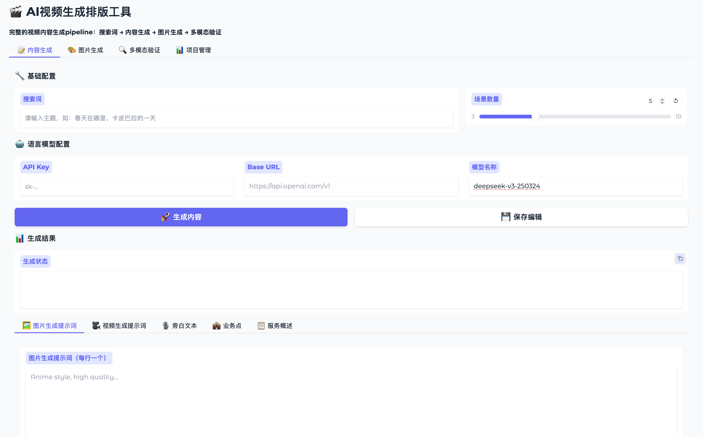
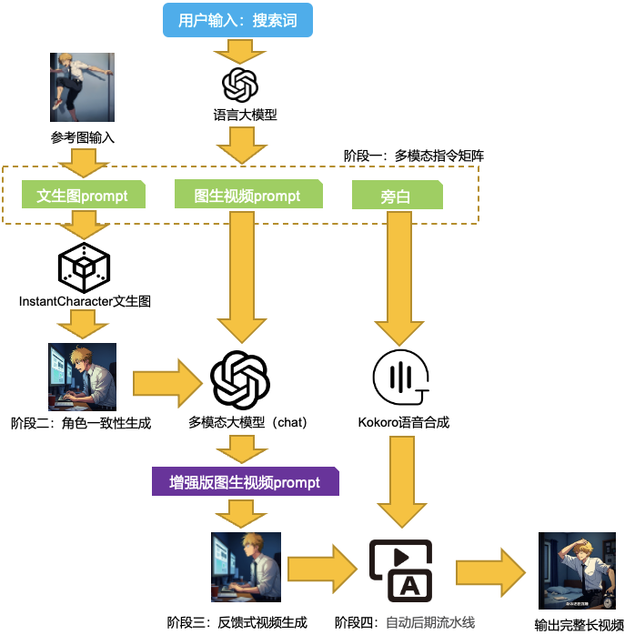

# SearchVidGen: From Idea to Video with a Single Click

[](https://opensource.org/licenses/MIT)
[](https://www.python.org/downloads/)

**SearchVidGen** is an end-to-end, fully automated cognitive video synthesis engine. Users only need to input a simple search query or sentence, and the system will autonomously generate a high-quality short video containing **a coherent storyline, consistent visual characters, cinematic camera angles, voiceover narration, and precise subtitles**.

We do not create a single AI model, but instead build an automated bridge connecting **human abstract intent** to **AI-rendered video**. This repository open-sources the **complete pipeline code** to achieve this goal.



## Core Features

*   **💡 Intent-Driven:** Starting from a simple search query (e.g., "a programmer's struggle and confusion"), it automatically deconstructs and generates a complete multimodal script.
*   **🎭 Character Consistency:** Using [InstantCharacter](https://github.com/Tencent-Hunyuan/InstantCharacter) technology, it maintains visual consistency for the core character across all scenes with just a single reference image.
*   **🔄 Closed-Loop Feedback:** Before image-to-video generation, the system "reviews" the already generated images and intelligently optimizes the motion descriptions (Prompts), significantly improving image-video consistency and video quality.
*   **🧩 Modular Pipeline:** Seamlessly integrates multiple top-tier open-source models, covering the entire process of **script generation -> scene image generation -> video synthesis -> audio synthesis -> subtitle generation**, with each step runnable independently.
*   **🌐 100% Open-Source Stack:** Built entirely on open-source models widely recognized by the community, making it easy to reproduce, extend, and customize.

## Technology Stack

SearchVidGen ingeniously orchestrates the following SOTA open-source projects to form a synergistic whole:

| Stage             | Function            | Core Technology                                      |
| :---------------- | :------------------ | :--------------------------------------------------- |
| **1. Intent Parsing & Scriptwriting** | Generate multimodal instructions from search queries | `DeepSeek` / `GPT-4` (Configurable)                                   |
| **2. Character-Consistent Image Generation** | Generate scene images with unified characters | [Tencent-Hunyuan/InstantCharacter](https://github.com/Tencent-Hunyuan/InstantCharacter) |
| **3. Image-to-Video Synthesis** | Convert static images into dynamic videos | [Wan-Video/Wan2.1 (I2V)](https://github.com/Wan-Video/Wan2.1)   |
| **4. Prompt Enhancement** | Optimize video prompts based on images | Multimodal models such as `o4-mini`/`qwen2.5-vl` (Image-Text Understanding)                                            |
| **5. Speech Synthesis** | Generate voiceover audio | [hexgrad/kokoro](https://github.com/hexgrad/kokoro)             |
| **6. Final Video Processing & Subtitling** | Video/audio stitching and subtitle generation | `FFmpeg` / [WEIFENG2333/VideoCaptioner](https://github.com/WEIFENG2333/VideoCaptioner) |

## Workflow Overview



1.  **Input:** The user provides a search query and an optional character reference image.
2.  **Script Generation:** Calls an LLM to generate a "multimodal instruction matrix" containing scene descriptions, camera directions, and voiceover text.
3.  **Image Generation:** Based on scene descriptions and reference images, calls `InstantCharacter` to batch-generate keyframe images for all scenes.
4.  **Prompt Enhancement:** Calls a multimodal model to "review" the generated images and optimizes the original camera directions accordingly, achieving closed-loop feedback.
5.  **Video Clip Generation:** Drives the `Wan2.1` model to convert each scene image and its corresponding (optimized) Prompt into video clips.
6.  **Audio Generation:** Calls `Kokoro TTS` to generate corresponding audio clips based on the voiceover text.
7.  **Final Assembly:** Uses `FFmpeg` to stitch together all video and audio clips, and calls `VideoCaptioner` to generate subtitles for the final video.
8.  **Output:** A ready-to-publish MP4 video file.

## Getting Started

### 1. Prerequisites

First, clone this repository:
```bash
git clone https://github.com/ZhijunLStudio/SearchVidGen.git
cd SearchVidGen
```
Next, install the project and all its core open-source dependencies. Please ensure their installation and configuration are complete:
*   **Core Dependency Projects (Must be installed beforehand):**
    *   [Tencent-Hunyuan/InstantCharacter](https://github.com/Tencent-Hunyuan/InstantCharacter)
    *   [Wan-Video/Wan2.1](https://github.com/Wan-Video/Wan2.1)
    *   [hexgrad/kokoro](https://github.com/hexgrad/kokoro)
    *   [WEIFENG2333/VideoCaptioner](https://github.com/WEIFENG2333/VideoCaptioner)
*   **Python Dependencies:**
    ```bash
    pip install -r requirements.txt
    ```

### 2. Model Download & Configuration

You need to download all dependent pre-trained models according to the tech stack list above, and **modify the corresponding model paths in each script**. Additionally, configure your API keys where required (e.g., in `src/llm_client.py`).

### 3. Step-by-Step Pipeline Execution

> **Note:** The current version requires you to manually execute the following scripts in order. Before running, modify parameters such as file paths and query contents according to the comments in each script.

**Step 1: Generate Multimodal Instruction Matrix**
```bash
# Modify the `search_query_example` variable in src/llm_client.py
python src/llm_client.py
```

**Step 2: Generate Scene Images**
```bash
# Modify the input/output directory paths and reference image path in src/image_generator.py
python src/image_generator.py
```

**Step 3: Enhance Image-to-Video Prompts**
```bash
# Modify the paths in src/img2vid_description.py
python src/img2vid_description.py
```

**Step 4: Generate Video Clips**
```bash
# Modify the model and file paths in src/video_generator.sh
bash src/video_generator.sh
```

**Step 5: Generate Audio Clips**
```bash
# Modify the paths in src/audio_generator.py
python src/audio_generator.py
```

**Step 6: Stitch Video and Audio**
```bash
# Modify the paths in src/video_processor.py
python src/video_processor.py
```

**Step 7: (Optional) Generate Subtitles**
Please refer to the official guide of the [VideoCaptioner](https://github.com/WEIFENG2333/VideoCaptioner) project to add subtitles to the final video generated in the previous step.


## Roadmap

We are excited about the future of SearchVidGen and plan to explore the following directions:

-   [ ] **Master Script:** Develop a `main.py` script to chain all step-by-step operations together, enabling one-click end-to-end execution.
-   [ ] **Config File:** Introduce a `config.yaml` file to centrally manage all configurable paths and parameters, improving usability.
-   [ ] **Interactive UI:** Develop a simple Web UI interface allowing for human intervention and fine-tuning at key nodes.
-   [ ] **Performance Optimization:** Optimize model loading and inference processes to reduce end-to-end generation time.

## Contributing

We warmly welcome contributions from the community! If you have good ideas or code improvements, please feel free to submit a Pull Request. Discussions in the Issues section are also welcome.

## Acknowledgements

The implementation of this project relies on the following outstanding open-source projects. We extend our sincere gratitude to all original authors and contributors!

*   [Tencent-Hunyuan/InstantCharacter](https://github.com/Tencent-Hunyuan/InstantCharacter)
*   [Wan-Video/Wan2.1](https://github.com/Wan-Video/Wan2.1)
*   [hexgrad/kokoro](https://github.com/hexgrad/kokoro)
*   [WEIFENG2333/VideoCaptioner](https://github.com/WEIFENG2333/VideoCaptioner)
*   And all the foundational libraries and frameworks we used.
