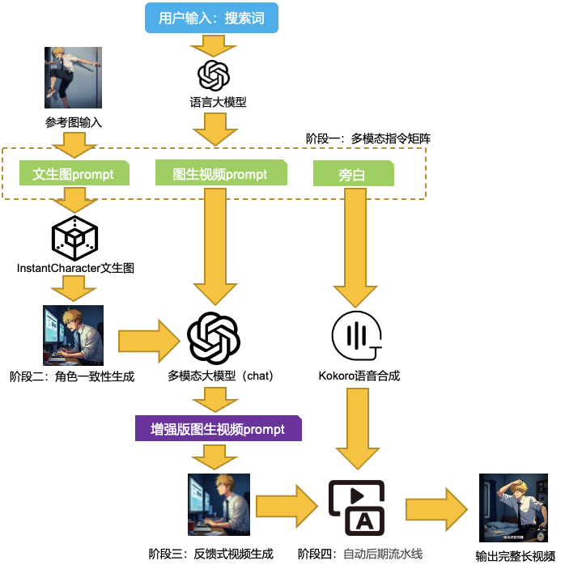

# SearchVidGen: 从一个想法到一部影片，只需一键

[](https://opensource.org/licenses/MIT)
[](https://www.python.org/downloads/)

**SearchVidGen** 是一个端到端的、全自动的认知型视频合成引擎。用户仅需输入一个简单的搜索词或一句话，系统便能自主生成一部包含**连贯故事情节、统一视觉角色、电影感镜头、语音旁白和精准字幕**的高质量短视频。

我们不创造单一的AI模型，而是构建了一座连接**人类抽象意图**与**AI具象影片**的
.自动化桥梁。这个仓库开源了实现这一目标的**完整流水线代码**。


## 核心特性 (Core Features)

*   **💡 意图驱动 (Intent-Driven):** 从简单的搜索词（如“一个程序员的奋斗与迷茫”）出发，自动解构并生成完整的多模态剧本。
*   **🎭 角色一致性 (Character Consistency):** 使用 [InstantCharacter](https://github.com/Tencent-Hunyuan/InstantCharacter) 技术，仅需一张参考图即可在所有场景中维持核心角色的视觉统一。
*   **🔄 闭环反馈增强 (Closed-Loop Feedback):** 在图生视频前，系统会“审视”已生成的图片，并智能优化动态描述（Prompt），极大提升图文一致性和视频质量。
*   **🧩 模块化流水线 (Modular Pipeline):** 无缝整合了多个顶尖开源模型，涵盖**剧本生成 -> 场景图生成 -> 视频合成 -> 音频合成 -> 字幕生成**的全过程，每个步骤可独立运行。
*   **🌐 100% 开源技术栈 (100% Open-Source Stack):** 完全基于社区广泛认可的开源模型构建，易于复现、扩展和定制。

## 技术栈揭秘 (Technology Stack)

SearchVidGen 巧妙地编排了以下SOTA开源项目，形成了一个协同工作的有机整体：

| 阶段 (Stage)            | 功能 (Function)            | 核心技术 (Core Technology)                                      |
| :---------------------- | :------------------------- | :-------------------------------------------------------------- |
| **1. 意图解析 & 剧本创作** | 从搜索词生成多模态指令     | `DeepSeek` / `GPT-4` (可配置)                                   |
| **2. 角色一致性图像生成** | 生成统一角色的场景图       | [Tencent-Hunyuan/InstantCharacter](https://github.com/Tencent-Hunyuan/InstantCharacter) |
| **3. 图生视频合成**       | 将静态图转化为动态视频     | [Wan-Video/Wan2.1 (I2V)](https://github.com/Wan-Video/Wan2.1)   |
| **4. 提示词增强**         | 根据图片优化视频Prompt     | 多模态模型如`o4-mini`/`qwen2.5-vl` (图文理解)                                            |
| **5. 语音合成**           | 生成旁白音频               | [hexgrad/kokoro](https://github.com/hexgrad/kokoro)             |
| **6. 最终视频处理与字幕** | 视频/音频拼接与字幕生成    | `FFmpeg` / [WEIFENG2333/VideoCaptioner](https://github.com/WEIFENG2333/VideoCaptioner) |

## 工作流概览 (Workflow Overview)



1.  **输入:** 用户提供一个搜索词和一张可选的角色参考图。
2.  **剧本生成:** 调用大语言模型，生成包含场景描述、镜头指令和旁白的“多模态指令矩阵”。
3.  **图像生成:** 基于场景描述和参考图，调用`InstantCharacter`批量生成所有场景的关键帧图像。
4.  **提示词增强:** 调用多模态模型“审视”已生成的图像，并据此优化原始的镜头指令，实现闭环反馈。
5.  **视频片段生成:** 驱动`Wan2.1`模型，将每个场景图和对应的（优化后）Prompt转化为视频片段。
6.  **音频生成:** 调用`Kokoro TTS`，根据旁白文本生成对应的音频片段。
7.  **总装:** 使用`FFmpeg`将所有视频和音频片段拼接起来，并调用`VideoCaptioner`为最终视频生成字幕。
8.  **输出:** 一部可以直接发布的MP4视频文件。

## 快速开始 (Getting Started)

### 1. 环境准备 (Prerequisites)

首先，克隆本仓库：
```bash
git clone https://github.com/ZhijunLStudio/SearchVidGen.git
cd SearchVidGen
```
然后，安装本项目及所有核心依赖的开源项目。请确保它们的安装和配置都已完成：
*   **核心依赖项目 (必须预先安装):**
    *   [Tencent-Hunyuan/InstantCharacter](https://github.com/Tencent-Hunyuan/InstantCharacter)
    *   [Wan-Video/Wan2.1](https://github.com/Wan-Video/Wan2.1)
    *   [hexgrad/kokoro](https://github.com/hexgrad/kokoro)
    *   [WEIFENG2333/VideoCaptioner](https://github.com/WEIFENG2333/VideoCaptioner)
*   **Python 依赖:**
    ```bash
    pip install -r requirements.txt
    ```

### 2. 模型下载与配置 (Model Setup)

您需要根据上述技术栈列表，下载所有依赖的预训练模型，并**在各个脚本中修改对应的模型路径**。此外，请在`src/llm_client.py`等需要API的地方配置您的密钥。

### 3. 分步运行流水线 (Step-by-Step Execution)

> **注意:** 当前版本需要您手动按顺序执行以下脚本。请在执行前，根据脚本内的注释修改文件路径、查询内容等参数。

**第1步: 生成多模态指令矩阵**
```bash
# 修改 src/llm_client.py 中的 `search_query_example` 变量
python src/llm_client.py
```

**第2步: 生成场景图像**
```bash
# 修改 src/image_generator.py 中的输入/输出文件夹路径和参考图路径
python src/image_generator.py
```

**第3步: 增强图生视频Prompt**
```bash
# 修改 src/img2vid_description.py 中的路径
python src/img2vid_description.py
```

**第4步: 生成视频片段**
```bash
# 修改 src/video_generator.sh 中的模型和文件路径
bash src/video_generator.sh
```

**第5步: 生成音频片段**
```bash
# 修改 src/audio_generator.py 中的路径
python src/audio_generator.py
```

**第6步: 拼接视频与音频**
```bash
# 修改 src/video_processor.py 中的路径
python src/video_processor.py
```

**第7步: (可选) 生成字幕**
请参照 [VideoCaptioner](https://github.com/WEIFENG2333/VideoCaptioner) 项目的官方指南，为上一步生成的最终视频添加字幕。


## 路线图 (Roadmap)

我们对SearchVidGen的未来充满期待，并计划在以下方向进行探索：

-   [ ] **主控脚本 (Master Script):** 开发一个`main.py`脚本，将所有分步操作串联起来，实现一键式端到端执行。
-   [ ] **配置文件 (Config File):** 引入`config.yaml`，将所有可变路径和参数集中管理，提高易用性。
-   [ ] **交互式可控性 (Interactive UI):** 开发一个简单的Web UI界面，允许在关键节点进行人工干预和微调。
-   [ ] **性能优化 (Performance):** 优化模型加载和推理过程，缩短端到端的生成时间。

## 贡献 (Contributing)

我们热烈欢迎来自社区的任何贡献！如果您有好的想法或代码改进，请随时提交Pull Request。也欢迎在Issues区进行讨论。

## 致谢 (Acknowledgements)

本项目的实现离不开以下优秀的开源项目，在此向所有原作者和贡献者表示最诚挚的感谢！

*   [Tencent-Hunyuan/InstantCharacter](https://github.com/Tencent-Hunyuan/InstantCharacter)
*   [Wan-Video/Wan2.1](https://github.com/Wan-Video/Wan2.1)
*   [hexgrad/kokoro](https://github.com/hexgrad/kokoro)
*   [WEIFENG2333/VideoCaptioner](https://github.com/WEIFENG2333/VideoCaptioner)
*   以及所有我们使用的基础库和框架。